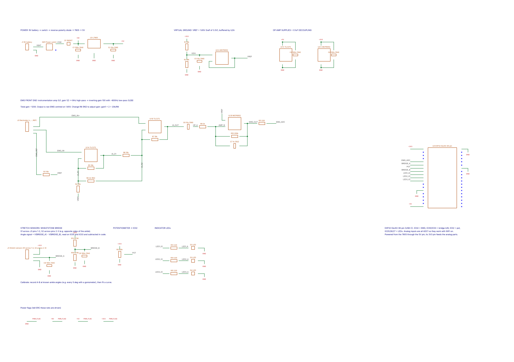
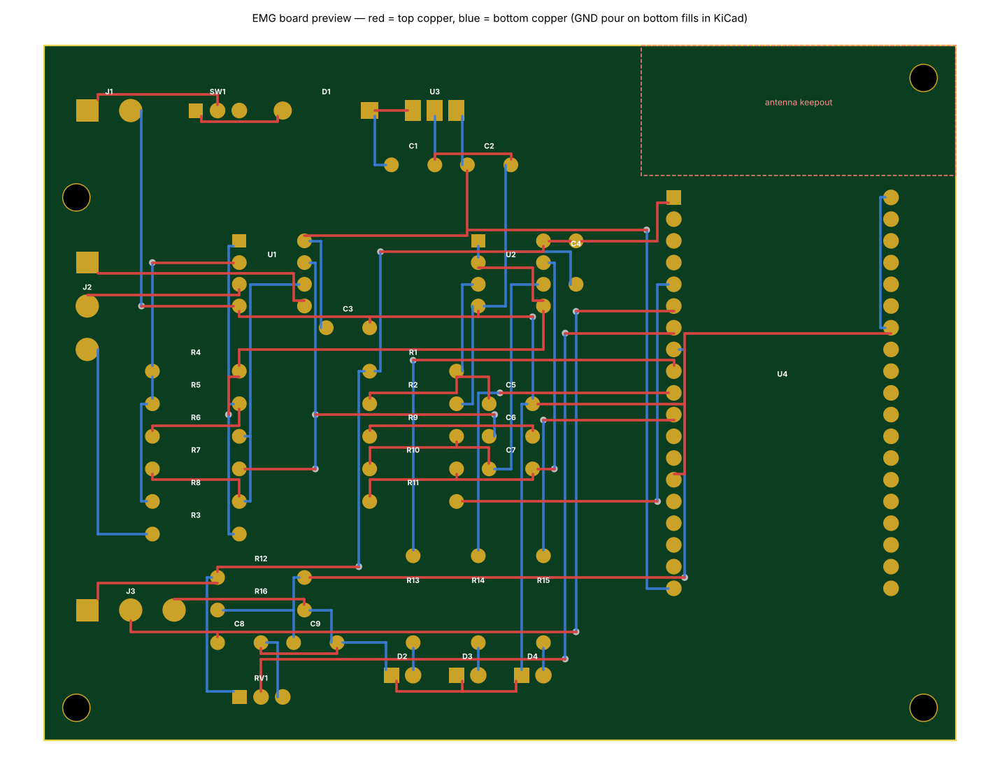
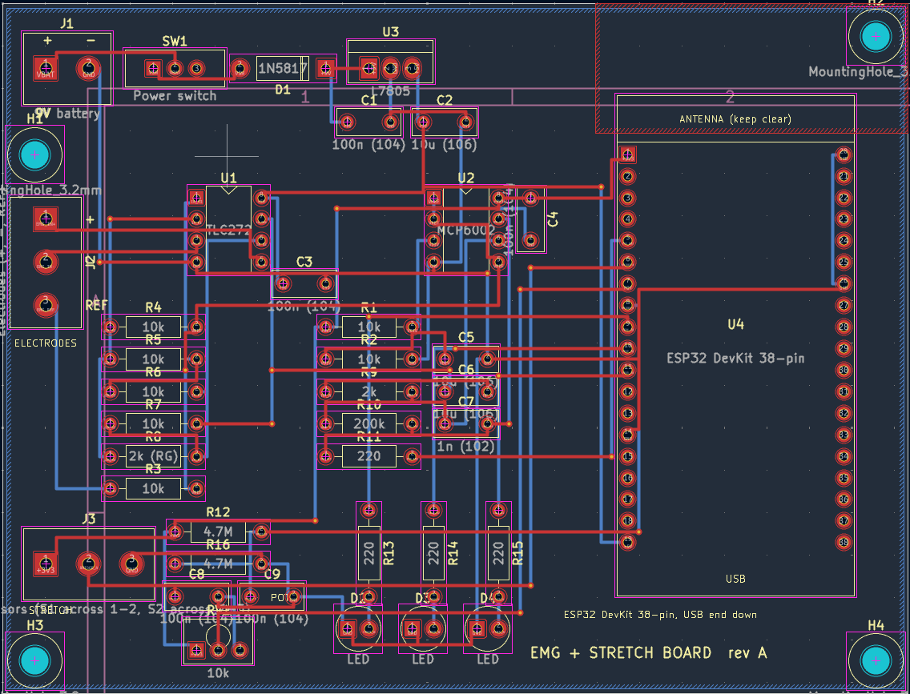
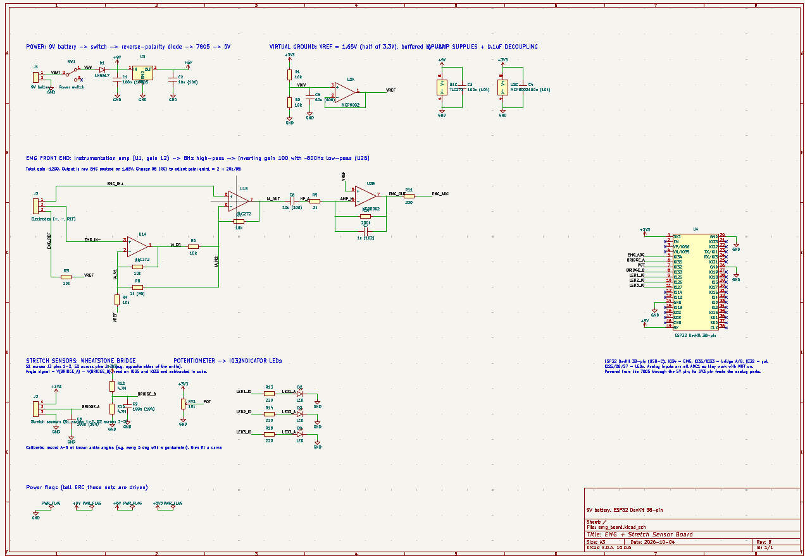

# DTE 2026

Hardware for the DTE Designathon project.

## EMG + Stretch Sensor Board

KiCad 8 project in [`hardware/emg_board/`](hardware/emg_board/). Open `emg_board.kicad_pro` in KiCad; the symbol and footprint libraries are project-local, so nothing needs to be installed.

```
hardware/emg_board/
├── emg_board.kicad_pro     project
├── emg_board.kicad_sch     schematic
├── emg_board.kicad_pcb     PCB layout
├── EMG_Board.kicad_sym     project symbol library
├── EMG_Board.pretty/       project footprint library (*.kicad_mod)
├── sym-lib-table           points to ${KIPRJMOD}/EMG_Board.kicad_sym
├── fp-lib-table            points to ${KIPRJMOD}/EMG_Board.pretty
└── docs/                   schematic and PCB previews and screenshots
```

The board runs from a 9 V battery through a switch, a reverse-polarity diode and a 7805 regulator into an ESP32 DevKit (38-pin). It carries:

- an EMG front end (instrumentation amp, 8 Hz high-pass, ~800 Hz low-pass, total gain ~1200) on IO34
- a Wheatstone bridge for two stretch sensors on IO35 / IO33
- a potentiometer on IO32
- three indicator LEDs on IO25 / IO26 / IO27




### KiCad screenshots

PCB layout:



Schematic:



## Microcontroller code

Arduino sketches in [`microcontroller_code/`](microcontroller_code/). Each sketch is in a folder with the same name, as the Arduino IDE expects.

- [`WiFi/`](microcontroller_code/WiFi/): ESP32 button that sends a "Danger mode approached, increase stiffness?" alert to the phone and Apple Watch through ntfy.sh. The notification has Increase stiffness and Decrease stiffness buttons that change the stiffness level (0 to 5) on the ESP32, which confirms with LED flashes and a follow-up notification. Before building, copy `secrets.example.h` to `secrets.h` and put your WiFi name and password in it. `secrets.h` is git-ignored so the password stays out of the repo.
- [`EMG/`](microcontroller_code/EMG/): reads the EMG signal on A3 and prints the raw value over serial at 9600 baud.
- [`RotationalDrive/`](microcontroller_code/RotationalDrive/): reads the outside stretch sensor on A1, zeroes at neutral, and lights a blue warning LED and a blinking red danger LED as the ankle rolls past the limits. Type an angle over serial to calibrate it to degrees (saved to EEPROM), or `z` to re-zero.

## CAD

SolidWorks files for the hydraulic right foot brace are in [`cad/hydraulic_brace/`](cad/hydraulic_brace/): the assembly (`hydraulics brace Assem.SLDASM`), the brace body (`hydraulic right foot brace`), `bottom brace`, `BottomBraceHydraulics`, `InnerBore`, `OuterBore` and `Gasket`. Keep the file names as they are, because the assembly finds its parts by name.
